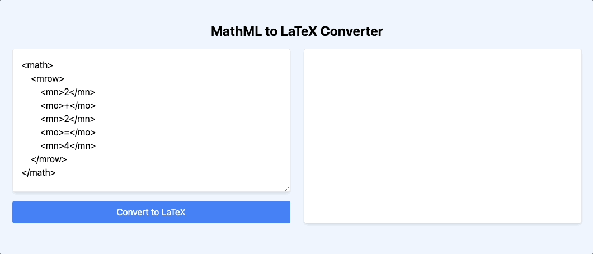

# mathml-to-latex

It converts [MathML](https://en.wikipedia.org/wiki/MathML) to [LaTeX](https://pt.wikipedia.org/wiki/LaTeX).

## Installation

If you use NPM

```
npm install mathml-to-latex --save
```

If you use Yarn

```
yarn add mathml-to-latex
```

## Usage

```javascript
import { MathMLToLaTeX } from 'mathml-to-latex';
// const { MathMLToLaTeX } = require('mathml-to-latex');

const mathml = `
      <math>
        <mrow>
          <mn>a</mn>
          <mo>+</mo>
          <mn>b</mn>
        </mrow>
      </math>
      `;

MathMLToLaTeX.convert(mathml);
// => a + b
```

```javascript
import { MathMLToLaTeX } from 'mathml-to-latex';
// const { MathMLToLaTeX } = require('mathml-to-latex');

const mathml = `
    <math>
        <mrow>
            <mi>A</mi>
            <mo>=</mo>
            <mfenced open = "[" close="]">
            <mtable>
                <mtr>
                <mtd><mi>x</mi></mtd>
                <mtd><mi>y</mi></mtd>
                </mtr>
                <mtr>
                <mtd><mi>z</mi></mtd>
                <mtd><mi>w</mi></mtd>
                </mtr>
            </mtable>
            </mfenced>
        </mrow>
    </math>
    `;

MathMLToLaTeX.convert(mathml);
// => A = \begin{bmatrix} x & y \\ z & w \end{bmatrix}
```

## Browser

Package is also available directly in the browser through CDN:

```html
<!DOCTYPE html>
<html lang="en">
  <head>
    <meta charset="UTF-8" />
    <meta name="viewport" content="width=device-width, initial-scale=1.0" />
    <title>MathML to LaTeX Converter</title>
    <!-- Including Tailwind CSS just for styling -->
    <link href="https://cdn.jsdelivr.net/npm/tailwindcss@2.2.15/dist/tailwind.min.css" rel="stylesheet" />
    <!-- Including mathml-to-latex library -->
    <script src="https://cdn.jsdelivr.net/npm/mathml-to-latex@1.3.0/dist/bundle.min.js"></script>
  </head>
  <body class="bg-blue-50 h-screen flex flex-col items-center justify-center">
    <h1 class="text-2xl font-bold mb-4">MathML to LaTeX Converter</h1>
    <div class="w-3/4 flex flex-row gap-6">
      <div class="flex flex-col w-1/2">
        <textarea id="mathmlInput" class="p-4 w-full h-64 border rounded shadow-md"></textarea>
        <button
          id="convertButton"
          class="mt-4 px-4 py-2 bg-blue-500 text-white rounded hover:bg-blue-600 focus:outline-none"
        >
          Convert to LaTeX
        </button>
      </div>
      <div class="w-1/2 bg-white p-4 border rounded shadow-md">
        <p id="latexOutput"></p>
      </div>
    </div>

    <script>
      const mathmlInput = document.getElementById('mathmlInput');
      const latexOutput = document.getElementById('latexOutput');
      const convertButton = document.getElementById('convertButton');

      mathmlInput.value = `\
<math>
    <mrow>
        <mn>2</mn>
        <mo>+</mo>
        <mn>2</mn>
        <mo>=</mo>
        <mn>4</mn>
    </mrow>
</math>`;

      convertButton.addEventListener('click', function () {
        const latex = MathMLToLaTeX.MathMLToLaTeX.convert(mathmlInput.value);
        latexOutput.textContent = latex;
      });
    </script>
  </body>
</html>
```

Output:


